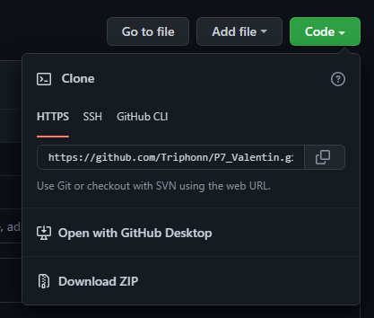

# Groupomania Social Network- 2022

Hello, and welcome to the Groupomania repository.

This project is a studying/training project, the goal was to make a company social network using back-end and front-end skills.
We needed to use a framework to get in this huge world of diversity. I chose VueJS which was the easiest and the most understandable for me.


## Installation

Here, I will explain how to intall my project.

First, you will need [NodeJS](https://nodejs.org/en/download/) and [VSCode](https://code.visualstudio.com/download) or any text editor.

Then, you can clone the repo with (if you have Git installed) :

```bash
git clone https://github.com/Triphonn/P7_Valentin
```

Or, you can also download the Zip :



Now, go to the project directory

```bash
cd P7_Valentin
```

Now, you have to install the dependencies of each part.

For the back, it is a bit more annoying, I'll let you check the README.md in the back folder, this will guide you to install the back-end and then you will be able to start the front.

For the front, you will use some cool stuff.

First, open a new terminal.

Now, go to the front directory :

```bash
cd front
```

Then, with [NodeJS](https://nodejs.org/en/download/) installed, you can use npm to install all the specific tools for this project.

You can start by running this command in your cmd :

```bash
npm install
```

This installed everything you needed, now you have to run your project to see what it looks like.

```bash
npm run serve
```

Your front is ready to work, make sure your back-end is started.

## Finished

You have now installed all the packages !
